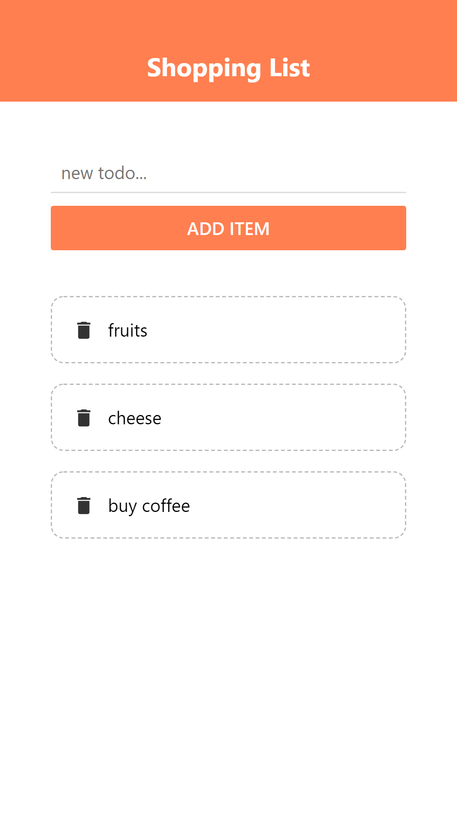

# SHOPPING_LIST

> Shopping list is a project for keeping records of a list of items to be bought.



The project demonstrates the use of React-Native and Expo.

## Features

-   Add Item
-   Delete Item

## Technology Used

-   JXS

-   CSS

    -   CSS Flexbox

-   [Expo](https://expo.io/)

-   Typescript

-   Javascript

    -   Arrow function.
    -   Destructuring assignment.

-   [Eslint](https://eslint.org/)

-   [NPM](https://www.npmjs.com/)

## Live Demo

[Coming Soon]()

### Development (Running locally)

-   Clone the project

```bash
git clone https://github.com/adejam/shopping-list.git

```

-   Install Dependencies

```bash
npm install
```

To automatically fix linter issues found (where possible):

```bash
npm run lint
```

You can also check against Prettier:

```bash
npm run format:check
```

and to have it actually fix (to the best of its ability) any format issues, run:

```bash
npm run format
```

To run the App

```bash
npm start
```

## Style Guides

-   [Git Style Guide](https://udacity.github.io/git-styleguide/)

## 👤 Author

### Adeleye Jamiu

-   Github: [@adejam](http://github.com/adejam)
-   Twitter: [@adeleye_oj](https://twitter.com/Adeleye_oj)
-   LinkedIn: [@adeleye-jamiu](https://linkedin.com/in/adeleye-jamiu)

## 🤝 Contributing

Contributions, issues and feature requests are welcome!

Feel free to check the [issues page](../../issues).

## Show your support

Give a ⭐️ if you like this project!

## Acknowledgments

-   [Expo](https://expo.io/)

## 📝 License

[MIT licensed](./LICENSE).
